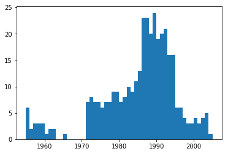
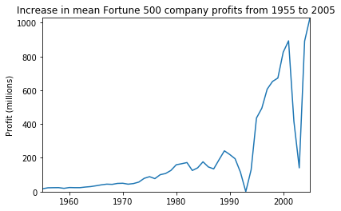
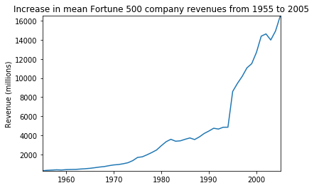
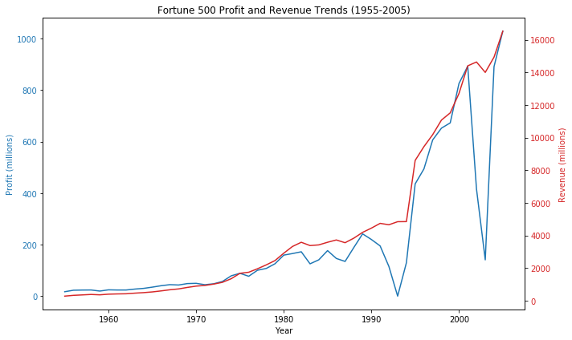

## Jupyter Notebook简介

Anaconda 是 **安装 Jupyter Notebook** 的最佳方式。安装完成之后，启动 Anaconda 的 Navigator，并启动 Notebook，呈现如下界面：


观察页面，可以看到浏览器中显示类似 `https://localhost:8888/tree` 的网址，代表本地运行着 Notebook 的服务器。


## 创建一个新的 Notebook

新建一个 Notebook（Python 3 *ipykernel*），会生成一个 `Untitled.ipynb` 文件。`.ipynb` 文件即所谓的一个 Notebook，实际是基于 JSON 格式的文本文件，并且包含元数据（可在菜单栏选择 `Edit > Edit Notebook Metadata` 查看）。

新建的 Notebook 的界面大致如下所示：


这里有两个关键元素：**cell** 和 **kernel**。

---

### cell（单元格）

是文本或代码的执行单元，由 kernel 执行。

主要包含两种类型的 cell：

- **代码 cell**：包含可被 kernel 执行的代码，执行后会在下方显示输出结果；
- **Markdown cell**：用于书写说明文字，支持 Markdown 语法。

---

### kernel（内核）

kernel 是计算引擎，用于执行 cell 中的文本或代码。本文使用的是 **Python 3 (ipykernel)** 内核。

---

### 试着输入一行代码，查看执行效果：


```python
print('Hello World!')
```

    Hello World!
    

## 代码执行与 In 标签说明

当你在代码 cell 中输入内容并执行之后，cell 左侧的标签会从 `In [ ]` 变成 `In [1]`。其中：

- `In` 代表输入；
- `[]` 中的数字表示当前代码在 kernel 执行的顺序编号；
- `In [*]` 表示该代码 cell 正在执行中。

例如，执行以下代码时，cell 会短暂显示为 `In [*]`，执行完成后变为 `In [1]`（或其他序号）：


```python
import time
time.sleep(3)
```

## cell 模式

Jupyter Notebook 中有两种工作模式：

- **编辑模式（Edit Mode）**：按下 `Enter` 进入，当前 cell 会出现绿色边框；
- **命令模式（Command Mode）**：按下 `Esc` 进入，当前 cell 会出现蓝色边框。

---

## 快捷键说明

使用 `Ctrl + Shift + P` 可以查看所有支持的命令。

在 **命令模式** 下，常用的快捷键包括：

- ↑ / ↓：上下移动选中的 cell；
- `A`：在上方插入一个新的 cell；
- `B`：在下方插入一个新的 cell；
- `M`：将选中的 cell 转为 **Markdown cell**；
- `Y`：将选中的 cell 转为 **代码 cell**；
- `D` + `D`：快速删除当前 cell；
- `Z`：撤销上一次删除操作；
- `H`：弹出快捷键帮助说明窗口。

在 **编辑模式** 下：

- `Ctrl + Shift + -`：以光标位置为界，把当前 cell 一分为二。

---

## Kernel（内核）

每个 Notebook 都基于一个 **Kernel（内核）** 运行。当你执行某个代码 cell 时，代码会发送到 Kernel 执行，执行结果返回并显示在界面中。

Kernel 是贯穿整个 Notebook 的，**它的状态在所有 cell 之间是共享的**。这意味着：

> 在某个 cell 中定义的变量、函数等，可以在其他任何 cell 中调用。

例如：


```python
import numpy as np
def square(x):
    return x * x
```

执行上述代码cell之后，后续cell可以使用np和square


```python
x = np.random.randint(1, 10)
y = square(x)
print('%d squared is %d' % (x, y))
```

    8 squared is 64
    

注意：Restart Kernal将清空保存在内存中的变量。同时，在浏览器中关闭一个正在运行的notebook页面，并未真正关闭终止Kernel的运行，其还是后台执行。要真正关闭，可选择File > Close and Halt，或者Kernel > Shutdown。

以下教程将分两个例子实现基本的Notebook编写，包括简单的Python程序和Python数据分析的例子。首先，重命名文档，更改Untitled并输入相关文件名。注意，在写作过程中，常用Ctrl + S保存已有的文档。

## 简单的 Python 程序示例

本节的主要目标是掌握 Python 的基本语法。要求完成一个基于 Python 的选择排序算法。

---

### ✅ 任务要求：

1. 定义一个 `selection_sort` 函数，实现选择排序功能；
2. 定义一个 `test` 函数，用于测试排序功能：包括输入数据、调用排序函数并输出排序结果。


```python
def selection_sort(arr):
    n = len(arr)
    for i in range(n):
        min_index = i
        for j in range(i + 1, n):
            if arr[j] < arr[min_index]:
                min_index = j
        arr[i], arr[min_index] = arr[min_index], arr[i]

def test():
    data = [64, 25, 12, 22, 11]
    print("原始数据：", data)
    selection_sort(data)
    print("排序后结果：", data)

test()
```

    原始数据： [64, 25, 12, 22, 11]
    排序后结果： [11, 12, 22, 25, 64]
    

## 数据分析的例子
在本例中，我们将分析历年财富世界 500 强企业的数据（1955–2005）。
## 设置
导入相关的工具库


```python
%matplotlib inline
import pandas as pd
import matplotlib.pyplot as plt
import seaborn as sns
```

pandas用于数据处理，matplotlib用于绘图，seaborn使绘图更美观。第一行不是python命令，而被称为line magic。%表示作用于一行，%%表示作用于全文。此处%matplotlib inline 表示使用matlib画图，并将图片输出。

随后，加载数据集。


```python
df = pd.read_csv('fortune500.csv')
```

## 检查数据集
上述代码执行生成的df对象，是pandas常用的数据结构，称为DataFrame，可以理解为数据表。


```python
df.head()
```


<div>
<style scoped>
    .dataframe tbody tr th:only-of-type {
        vertical-align: middle;
    }

    .dataframe tbody tr th {
        vertical-align: top;
    }

    .dataframe thead th {
        text-align: right;
    }
</style>
<table border="1" class="dataframe">
  <thead>
    <tr style="text-align: right;">
      <th></th>
      <th>Year</th>
      <th>Rank</th>
      <th>Company</th>
      <th>Revenue (in millions)</th>
      <th>Profit (in millions)</th>
    </tr>
  </thead>
  <tbody>
    <tr>
      <th>0</th>
      <td>1955</td>
      <td>1</td>
      <td>General Motors</td>
      <td>9823.5</td>
      <td>806</td>
    </tr>
    <tr>
      <th>1</th>
      <td>1955</td>
      <td>2</td>
      <td>Exxon Mobil</td>
      <td>5661.4</td>
      <td>584.8</td>
    </tr>
    <tr>
      <th>2</th>
      <td>1955</td>
      <td>3</td>
      <td>U.S. Steel</td>
      <td>3250.4</td>
      <td>195.4</td>
    </tr>
    <tr>
      <th>3</th>
      <td>1955</td>
      <td>4</td>
      <td>General Electric</td>
      <td>2959.1</td>
      <td>212.6</td>
    </tr>
    <tr>
      <th>4</th>
      <td>1955</td>
      <td>5</td>
      <td>Esmark</td>
      <td>2510.8</td>
      <td>19.1</td>
    </tr>
  </tbody>
</table>
</div>


```python
df.tail()
```


<div>
<style scoped>
    .dataframe tbody tr th:only-of-type {
        vertical-align: middle;
    }

    .dataframe tbody tr th {
        vertical-align: top;
    }

    .dataframe thead th {
        text-align: right;
    }
</style>
<table border="1" class="dataframe">
  <thead>
    <tr style="text-align: right;">
      <th></th>
      <th>Year</th>
      <th>Rank</th>
      <th>Company</th>
      <th>Revenue (in millions)</th>
      <th>Profit (in millions)</th>
    </tr>
  </thead>
  <tbody>
    <tr>
      <th>25495</th>
      <td>2005</td>
      <td>496</td>
      <td>Wm. Wrigley Jr.</td>
      <td>3648.6</td>
      <td>493</td>
    </tr>
    <tr>
      <th>25496</th>
      <td>2005</td>
      <td>497</td>
      <td>Peabody Energy</td>
      <td>3631.6</td>
      <td>175.4</td>
    </tr>
    <tr>
      <th>25497</th>
      <td>2005</td>
      <td>498</td>
      <td>Wendy's International</td>
      <td>3630.4</td>
      <td>57.8</td>
    </tr>
    <tr>
      <th>25498</th>
      <td>2005</td>
      <td>499</td>
      <td>Kindred Healthcare</td>
      <td>3616.6</td>
      <td>70.6</td>
    </tr>
    <tr>
      <th>25499</th>
      <td>2005</td>
      <td>500</td>
      <td>Cincinnati Financial</td>
      <td>3614.0</td>
      <td>584</td>
    </tr>
  </tbody>
</table>
</div>


对数据属性列进行重命名，以便在后续访问


```python
df.columns = ['year', 'rank', 'company', 'revenue', 'profit']
```

接下来，检查数据条目是否加载完整。


```python
len(df)
```


    25500


从1955至2055年总共有25500条目录。然后，检查属性列的类型。


```python
df.dtypes
```


    year         int64
    rank         int64
    company     object
    revenue    float64
    profit      object
    dtype: object


其他属性列都正常，但是对于profit属性，期望的结果是float类型，因此其可能包含非数字的值，利用正则表达式进行检查。


```python
non_numberic_profits = df.profit.str.contains('[^0-9.-]')
df.loc[non_numberic_profits].head()
```


<div>
<style scoped>
    .dataframe tbody tr th:only-of-type {
        vertical-align: middle;
    }

    .dataframe tbody tr th {
        vertical-align: top;
    }

    .dataframe thead th {
        text-align: right;
    }
</style>
<table border="1" class="dataframe">
  <thead>
    <tr style="text-align: right;">
      <th></th>
      <th>year</th>
      <th>rank</th>
      <th>company</th>
      <th>revenue</th>
      <th>profit</th>
    </tr>
  </thead>
  <tbody>
    <tr>
      <th>228</th>
      <td>1955</td>
      <td>229</td>
      <td>Norton</td>
      <td>135.0</td>
      <td>N.A.</td>
    </tr>
    <tr>
      <th>290</th>
      <td>1955</td>
      <td>291</td>
      <td>Schlitz Brewing</td>
      <td>100.0</td>
      <td>N.A.</td>
    </tr>
    <tr>
      <th>294</th>
      <td>1955</td>
      <td>295</td>
      <td>Pacific Vegetable Oil</td>
      <td>97.9</td>
      <td>N.A.</td>
    </tr>
    <tr>
      <th>296</th>
      <td>1955</td>
      <td>297</td>
      <td>Liebmann Breweries</td>
      <td>96.0</td>
      <td>N.A.</td>
    </tr>
    <tr>
      <th>352</th>
      <td>1955</td>
      <td>353</td>
      <td>Minneapolis-Moline</td>
      <td>77.4</td>
      <td>N.A.</td>
    </tr>
  </tbody>
</table>
</div>


确实存在这样的记录，profit这一列为字符串，统计一下到底存在多少条这样的记录。


```python
len(df.profit[non_numberic_profits])

```


    369


总体来说，利润（profit）列包含非数字的记录相对来说较少。更进一步，使用直方图显示一下按照年份的分布情况。


```python
bin_sizes, _, _ = plt.hist(df.year[non_numberic_profits], bins=range(1955, 2006))
```





可见，单独年份这样的记录数都少于25条，即少于4%的比例。这在可以接受的范围内，因此删除这些记录。


```python
df = df.loc[~non_numberic_profits]
df.profit = df.profit.apply(pd.to_numeric)
```

再次检查数据记录的条目数。


```python
len(df)
```


    25131


```python
df.dtypes
```


    year         int64
    rank         int64
    company     object
    revenue    float64
    profit     float64
    dtype: object


可见，上述操作已经达到清洗无效数据记录的效果。

## 使用matplotlib进行绘图
接下来，以年分组绘制平均利润和收入。首先定义变量和方法。


```python
group_by_year = df.loc[:, ['year', 'revenue', 'profit']].groupby('year')
avgs = group_by_year.mean()
x = avgs.index
y1 = avgs.profit
def plot(x, y, ax, title, y_label):
    ax.set_title(title)
    ax.set_ylabel(y_label)
    ax.plot(x, y)
    ax.margins(x=0, y=0)
```

现在开始绘图


```python
fig, ax = plt.subplots()
plot(x, y1, ax, 'Increase in mean Fortune 500 company profits from 1955 to 2005', 'Profit (millions)')
```





看起来像指数增长，但是1990年代初期出现急剧的下滑，对应当时经济衰退和网络泡沫。再来看看收入曲线。


```python
y2 = avgs.revenue
fig, ax = plt.subplots()
plot(x, y2, ax, 'Increase in mean Fortune 500 company revenues from 1955 to 2005', 'Revenue (millions)')
```





```python
# 利润与收入双轴图示例代码
import matplotlib.pyplot as plt

# 假设 x 为年份，y1 为利润，y2 为收入
x = avgs.index                 # 年份
y1 = avgs.profit              # 利润（单位：百万）
y2 = avgs.revenue            # 收入（单位：百万）

fig, ax1 = plt.subplots(figsize=(10, 6))

# 左侧 y 轴：利润
color = 'tab:blue'
ax1.set_xlabel('Year')
ax1.set_ylabel('Profit (millions)', color=color)
ax1.plot(x, y1, color=color, label='Profit')
ax1.tick_params(axis='y', labelcolor=color)

# 右侧 y 轴：收入
ax2 = ax1.twinx()  # 共享 x 轴
color = 'tab:red'
ax2.set_ylabel('Revenue (millions)', color=color)
ax2.plot(x, y2, color=color, label='Revenue')
ax2.tick_params(axis='y', labelcolor=color)

# 添加标题
plt.title('Fortune 500 Profit and Revenue Trends (1955-2005)')

# 显示图例（可选）
fig.tight_layout()  # 避免标签重叠
plt.show()

```





公司收入曲线并没有出现急剧下降，可能是由于财务会计的处理。对数据结果进行标准差处理。


```python
def plot_with_std(x, y, stds, ax, title, y_label):
    ax.fill_between(x, y - stds, y + stds, alpha=0.2)
    plot(x, y, ax, title, y_label)
fig, (ax1, ax2) = plt.subplots(ncols=2)
title = 'Increase in mean and std Fortune 500 company %s from 1955 to 2005'
stds1 = group_by_year.std().profit.values
stds2 = group_by_year.std().revenue.values
plot_with_std(x, y1.values, stds1, ax1, title % 'profits', 'Profit (millions)')
plot_with_std(x, y2.values, stds2, ax2, title % 'revenues', 'Revenue (millions)')
fig.set_size_inches(14, 4)
fig.tight_layout()
```


可见，不同公司之间的收入和利润差距惊人，那么到底前10%和后10%的公司谁的波动更大了？此外，还有很多有价值的信息值得进一步挖掘。
